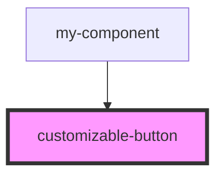

# customizable-button

<!-- Auto Generated Below -->

## Properties

| Property          | Attribute          | Description | Type      | Default     |
| ----------------- | ------------------ | ----------- | --------- | ----------- |
| `backgroundColor` | `background-color` |             | `string`  | `undefined` |
| `border`          | `border`           |             | `string`  | `undefined` |
| `borderRadius`    | `border-radius`    |             | `string`  | `undefined` |
| `buttonText`      | `button-text`      |             | `string`  | `undefined` |
| `fontFamily`      | `font-family`      |             | `string`  | `undefined` |
| `fontSize`        | `font-size`        |             | `string`  | `undefined` |
| `fontWeight`      | `font-weight`      |             | `string`  | `undefined` |
| `icon`            | `icon`             |             | `string`  | `undefined` |
| `iconRight`       | `icon-right`       |             | `boolean` | `undefined` |
| `lineHeight`      | `line-height`      |             | `string`  | `undefined` |
| `paddingBottom`   | `padding-bottom`   |             | `string`  | `undefined` |
| `paddingLeft`     | `padding-left`     |             | `string`  | `undefined` |
| `paddingRight`    | `padding-right`    |             | `string`  | `undefined` |
| `paddingTop`      | `padding-top`      |             | `string`  | `undefined` |
| `textColor`       | `text-color`       |             | `string`  | `undefined` |
| `textDecoration`  | `text-decoration`  |             | `string`  | `undefined` |

## Events

| Event         | Description | Type                |
| ------------- | ----------- | ------------------- |
| `buttonClick` |             | `CustomEvent<void>` |

## Dependencies

### Used by

 - [my-component](../my-component)

### Graph

----------------------------------------------

*Built with [StencilJS](https://stenciljs.com/)*
